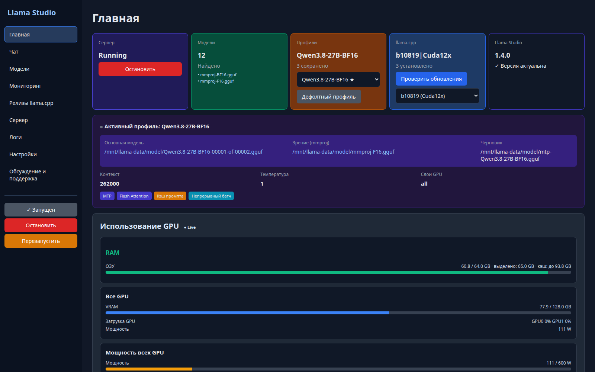
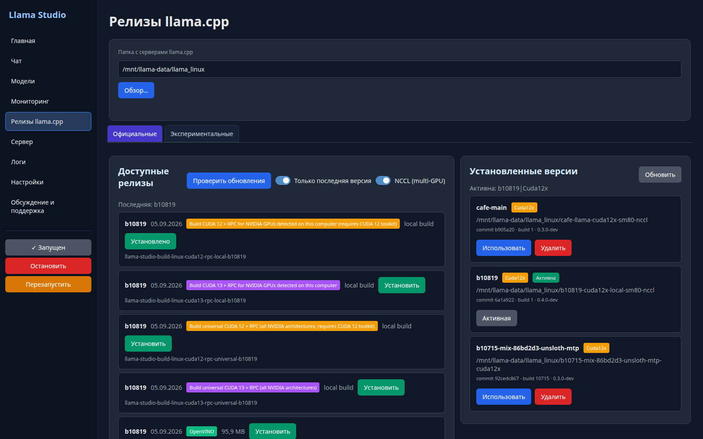
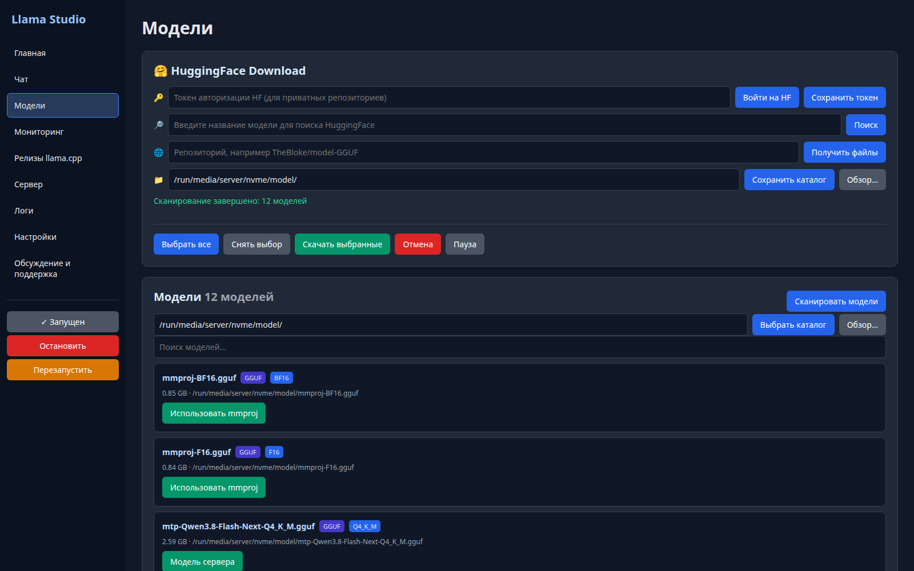
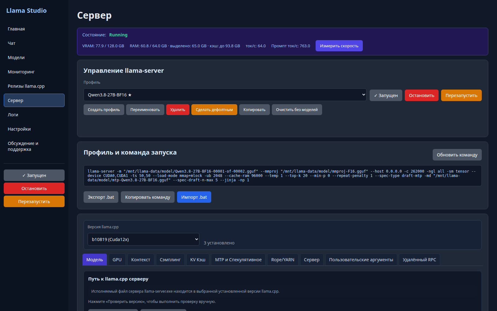
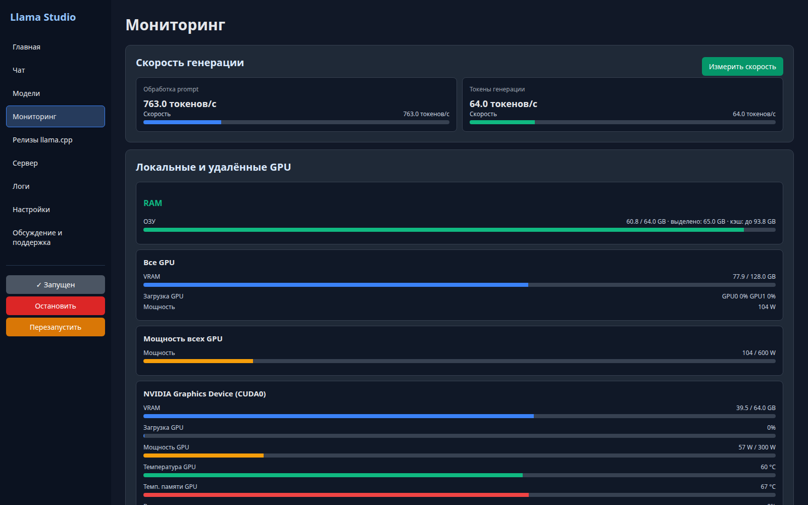
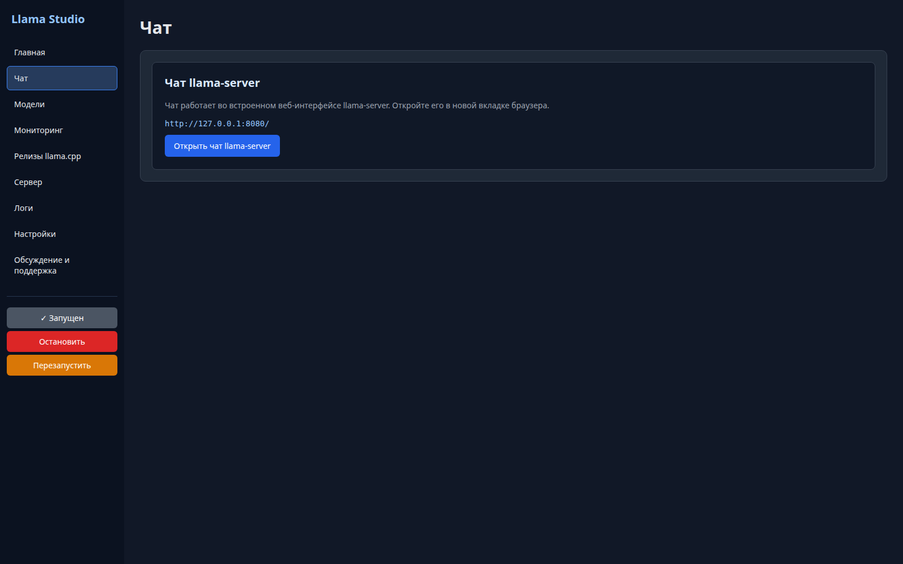
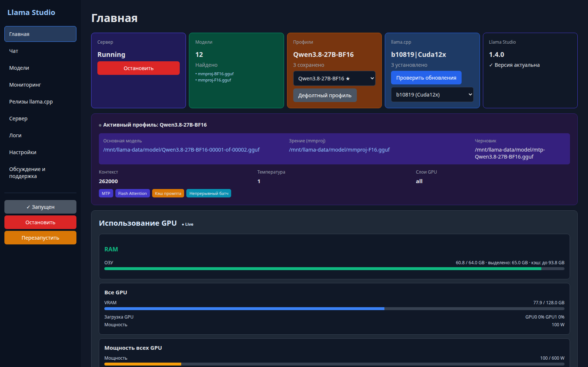
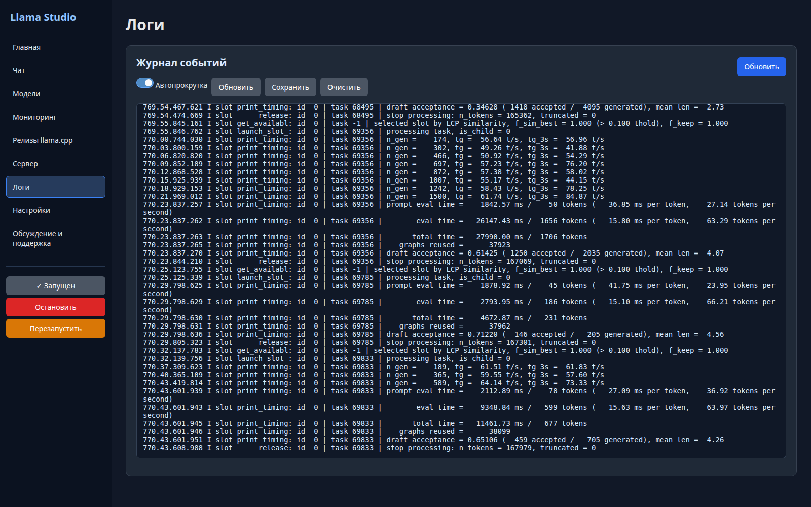
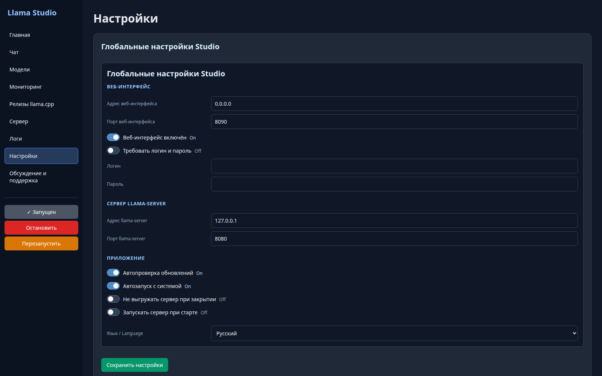
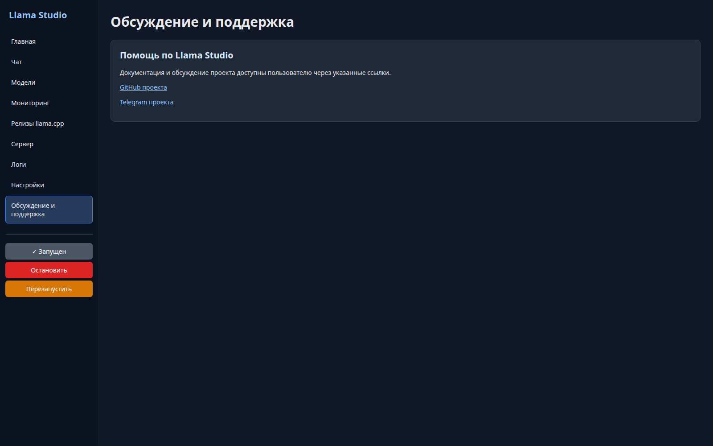

**[Русский](README.md)** · **[English](README.en.md)**

# Llama Studio

**Llama Studio** is a manager for local GGUF models and [llama.cpp](https://github.com/ggml-org/llama.cpp) servers. One application: it starts and controls `llama-server`, manages model profiles, GPU distribution, Hugging Face model downloads and llama.cpp builds.

The interface is dark-themed, available in **English and Russian**. It works in two forms:

- **Desktop** (Avalonia) — the regular application window (Windows and Linux);
- **Web interface** — a built-in server reachable from any browser over the network (default `http://<server-ip>:8090`). The web pages are identical to the desktop pages; the screenshots in this guide are of the web interface.

## Contents

1. [Features](#1-features)
2. [System requirements](#2-system-requirements)
3. [Installation](#3-installation)
4. [First 5 minutes](#4-first-5-minutes)
5. [llama.cpp: installs and builds](#5-llamacpp-installs-and-builds)
6. [Models: local and Hugging Face](#6-models-local-and-hugging-face)
7. [Profiles](#7-profiles)
8. [Server: start and control](#8-server-start-and-control)
9. [Monitoring](#9-monitoring)
10. [Measuring speed](#10-measuring-speed)
11. [Chat](#11-chat)
12. [Remote RPC (another machine's GPU)](#12-remote-rpc-another-machines-gpu)
13. [Logs](#13-logs)
14. [Settings and localization](#14-settings-and-localization)
15. [Multi-GPU quick guide](#15-multi-gpu-quick-guide)
16. [FAQ](#16-faq)
17. [Support](#17-support)

---

## 1. Features

- Start, stop and restart a local llama.cpp server.
- Profiles: different models and workloads in one app.
- Install **prebuilt** llama.cpp builds (CUDA 12/13, Vulkan, CPU, OpenVINO) and **local builds compiled for your own GPUs**.
- Distribute a model across one or several GPUs without typing device strings by hand.
- Manual tensor split or automatic distribution by llama.cpp.
- Monitoring: VRAM, RAM (including committed memory and cache), GPU load, power, temperatures, fans.
- Hugging Face search, repository file inspection and GGUF downloads with pause and resume.
- Chat through llama-server's built-in web interface.
- Network web interface, logs, system tray (Windows), built-in app updates.

## 2. System requirements

| | Linux | Windows |
|---|---|---|
| Architecture | x64 (tested on Debian/Ubuntu) | Windows 10/11 x64 |
| .NET Runtime | **not required** (self-contained build) | **not required** |
| NVIDIA driver | required for GPU builds | required for GPU builds |
| CUDA Toolkit | **installed by the app** (12.8, driver untouched) | installed by the app |
| For local builds (Linux) | `git`, `cmake`, `gcc`/`g++`, `make`, internet access (GitHub) | — |
| Memory | model + context must fit into VRAM/RAM | same |

## 3. Installation

### 3.1. Linux

1. Download `LlamaStudio-<version>-linux-x64.tar.gz` from [Releases](https://github.com/satspace-cpu/llamastudio/releases).
2. Extract and run:

```bash
tar -xzf LlamaStudio-*-linux-x64.tar.gz
cd LlamaStudio-*-linux-x64
./LlamaStudio
```

Everything the app needs is inside the archive — no .NET installation required.

- Settings and profiles live in `~/.config/LlamaStudio/` (`settings.json` and the `profiles` folder).
- The web interface comes up immediately after start (default port **8090**).

### 3.2. Windows

1. Download `LlamaStudio.exe` from [Releases](https://github.com/satspace-cpu/llamastudio/releases).
2. Run it. The exe is self-contained, no .NET required.

### 3.3. First start

When opened you see the Home page:



Top cards: **Server** (Running/Stopped + start/stop button), **Models** (GGUF files found in the models folder), **Profiles** (active profile and the list), **llama.cpp** (selected build and the update-check button), **Llama Studio** (application version). Below — the **active profile** card (model, mmproj, draft, context, temperature, GPU layers, enabled modes: MTP, Flash Attention, prompt cache, continuous batching) and the **live “GPU usage” block** (RAM and all GPUs).

On the left — navigation: Home, Chat, Models, Monitoring, llama.cpp Releases, Server, Logs, Settings, Discussion & Support. At the bottom — server control buttons.

## 4. First 5 minutes

1. **Settings** → set the models folder (or leave it empty — you can download via Hugging Face).
2. **Models** → download a model (section 6) or drop a GGUF into the folder and press “Refresh”.
3. **llama.cpp Releases** → “Check for updates” → pick the build for your GPU → “Install” (section 5; a local build takes 30–40 minutes).
4. **Server** → “Create profile”, pick the model and the installed llama.cpp build → “Start server”.
5. **Monitoring** → make sure the model loaded into memory, then press “Measure speed”.

## 5. llama.cpp: installs and builds



The page has two panels. **Left** — available releases (from llama.cpp on GitHub). **Right** — installed builds (inside the “llama.cpp servers folder”, path set at the top of the page).

### 5.1. What the release cards mean

Each card is one build variant of one release (tag):

- **local build** — “for your cards”: compiled **only for the architecture of the detected GPUs** (e.g. `sm80`). Smaller and faster; it is what the app recommends when it sees NVIDIA cards (badge “Build CUDA 12 + RPC for NVIDIA GPUs detected on this computer”).
- **universal** — the “full build”: compiled **for all NVIDIA architectures at once**. Works on any card, but is larger and compiles longer.
- **CUDA 12 / CUDA 13** — the CUDA branch. For CUDA 12 the app installs CUDA Toolkit 12.8 automatically if it is missing (the NVIDIA **driver is not changed**).
- **Vulkan, CPU, OpenVINO** — builds for other backends.
- **NCCL (multi-GPU)** checkbox — enables NCCL: with several GPUs the model is distributed faster and more efficiently (CUDA, multiple cards only).

The gray, disabled **“Installed”** button means this exact variant is already installed. Any other inactive button is gray too — active buttons are always bright.

### 5.2. What the app does during a local build install (Linux)

1. Clones llama.cpp sources from GitHub at the release tag into the service folder `.llama-studio-source/<version>` (≈28 MB; on a slow internet connection this step takes the longest — the clone is visible in “Logs”).
2. Installs **CUDA Toolkit 12.8** if missing (≈3 GB, build-time only; the NVIDIA driver is not touched).
3. Compiles the project (cmake + compiler) for your architecture: one card → `sm80` (etc.), several cards → the same architectures **+ NCCL**. This is the longest part: **30–40 minutes** on a typical server. While it builds the install button stays disabled; progress is shown in the bar above the cards.
4. Verifies the result: runs the built `llama-server --version` and checks the commit against the release tag. On mismatch the install is considered failed.
5. Puts the result into the installs folder: `<servers folder>/<version>-cuda12x-local-sm80-nccl/`.

**What ends up in the build folder** (example — b10819): the `llama-server` executable, all utilities (`llama-cli`, `llama-bench`, `llama-quantize`, `llama-gguf`, `llama-server` and dozens of others, including tests), the `libggml-*`, `libllama-*`, `libmtmd*` libraries, **NCCL** (`libnccl.so`), and the CUDA libraries it was built against (`libcudart.so.12`, `libcublas*`, etc.). The build is self-contained — nothing else is needed after installation.

> After the install, refresh the page (or press “Refresh” in the “Installed versions” panel) — the card turns gray “Installed”.

### 5.3. Installed versions

The right panel lists every build in the folder:

- **Use** — make this build the active selection (it appears in the profile, “llama.cpp version”).
- **Delete** — remove the build folder (the active one cannot be deleted).
- **Active** badge — the build currently used by the active profile.
- Under each — the commit and the llama.cpp version line.

### 5.4. Experimental builds

The “Experimental” tab lets you point at **any** GitHub repository (e.g. a llama.cpp fork with new features) and build it the same way. For experiments — not for daily work.

### 5.5. The llama.cpp version line

Recent llama.cpp releases read `version: 0.4.0-dev (build 1, commit 6a1a922)`. That is llama.cpp's own new versioning scheme (move to version tags): “build 1” is **not** an error and not a Llama Studio build number. Llama Studio verifies by **commit**, so installs and activation work correctly.

## 6. Models: local and Hugging Face



### 6.1. Local GGUF

Top of the page — search and the list of models from the folder set in settings. For each model: name, quantization (Q4_K_M, BF16…), size, path and buttons:

- **Server model** — set the file as the main model of the active profile;
- **Use mmproj** — set the file as the vision projector (mmproj) for multimodal models.

For **sharded** models the files are named `00001-of-00002.gguf`, `00002-of-00002.gguf` — it is **one** model split into files. The profile points to the first file; the rest are picked up automatically by naming.

### 6.2. Hugging Face

The “HuggingFace Download” panel:

1. **Token** (optional) — for private repositories: get a token at huggingface.co → Settings → Access tokens, paste it and press “Save token”. The token is stored locally.
2. **Search** — enter a name (e.g. `Qwen3.8` or `Llama-3.1-8B`), pick a repository from the results.
3. **Files** — the app fetches the repository file list; tick the GGUF files you want to download. For a sharded model tick **all** parts `00001-of-…`, `00002-of-…` and (if present) the matching `mmproj`. For MTP models also tick the `mtp-*.gguf` draft file (it becomes the “Draft” in the profile).
4. **Download** — into the models folder.

Downloads use **partial files**: pause, app restart or shutdown does not reset progress — the download resumes where it stopped. Buttons: Pause / Cancel. Watch free disk space: each file's size is shown in the list.

## 7. Profiles



A **profile** is a named bundle of “model + parameters + llama.cpp build”. One profile per model/workload: switching profiles switches the whole workspace.

Buttons above the list: **Create profile**, **Rename**, **Delete**, **Set as default** (profile opened at startup), **Copy** (duplicate of the current one), **Clear without models** (reset parameters, keep the model).

### 7.1. “Model” tab

- **Main model** — path to the GGUF (or assign it from the Models page).
- **Vision (mmproj)** — mmproj path for multimodal models; can be left empty.
- **Draft (MTP)** — draft model for speculative decoding (`mtp-*.gguf`).
- **llama.cpp version** — which installed build starts the server.

### 7.2. “GPU” tab

- **GPU layers** — how many model layers to offload to GPU (`all` — as many as fit; a number — exact).
- **Distribution mode** — `layer` (layers go to one card after another) or `tensor` (each layer is split across cards — multiple GPUs only).
- **Selected GPUs** — checkboxes for the detected cards; the checked ones participate in offload.
- **Main GPU** — the “primary” card (relevant for a single card or layer mode).
- For several GPUs — **manual percentage split** (`--tensor-split`), e.g. 50/50 or 60/40, with ±1% / ±5% fine-tune buttons. Or **Auto** — let llama.cpp pick the distribution to fit available memory.
- **Flash Attention, KV offload** — speed/memory optimizations (server flags).

> `--tensor-split` distributes the **model tensors** across cards — it is not a “workload percentage”. In auto mode the app writes no split — llama.cpp decides based on memory.

### 7.3. “Context” and “Sampling” tabs

- **Context**: `Context size` (e.g. 32768), `Batch size` / `UBatch size` (prompt processing batch sizes), `Threads` (CPU threads).
- **Sampling**: `Temperature`, `Top-K`, `Top-P`, `Min-P`, `Typical-P`, `Repeat penalty` and other generation parameters. Defaults are not written into the command.

### 7.4. “KV Cache” tab

- `Cache type K/V` — KV-cache quantization type (F16/Q8_0/Q4_0…) — saves VRAM.
- `Cache RAM` — RAM-cache limit (how many GB of system memory to give the cache); shown in monitoring as “cache: up to N GB”.
- `Cache reuse`, `Cont. batching`, `Context shift` — cache reuse, continuous batching of several requests, context shift on overflow.

### 7.5. “MTP & Speculative” and “Rope/YARN” tabs

- **MTP & Speculative**: speculative decoding type (`draft-mtp` — the model's built-in MTP layers), step limit. Speeds up generation when the model has MTP layers (the “MTP” badge on Home).
- **Rope/YARN**: positional-encoding scaling for long contexts (YARN factors) — only when extending context beyond the native limit.

### 7.6. “Server” tab

The `llama-server`'s own parameters: host and port (default `0.0.0.0:8080`), slots, metrics, the **server's built-in web UI** (chat), API key (optional), logging.

### 7.7. “Custom arguments” tab — what it is

The **Custom Arguments** field is any extra arguments the app appends to the `llama-server` start command **after** everything else. It is the “manual override” for cases where the built-in settings are not enough. Examples:

```
--prio 10                 # CPU process priority
--no-mmap                 # do not mmap the model
--cache-type-k q8_0       # override the cache type (if the KV tab field did not fit)
--jinja                   # chat-template jinja rendering
```

Rules: write arguments as in the terminal (flag and value), several arguments separated by spaces or newlines; a flag conflicting with a built-in one **overrides** it (llama.cpp takes the last one). Always check the **command preview** below before starting — it shows the exact final command.

### 7.8. Command preview

The “Profile and start command” block shows the **exact** command that starts the server. Buttons:

- **Refresh command** — rebuild the preview from the current fields;
- **Copy command** — to the clipboard;
- **Export .bat** — save the start as a Windows script (useful to run without Llama Studio);
- **Import .bat** — load a ready-made .bat into the profile.

### 7.9. “Remote RPC” tab

Parameters for connecting another machine's GPU (section 12).

## 8. Server: start and control

On the “Server” page (and “Home”):

- **Start / Stop / Restart** — control of the `llama-server` process.
- State on top: `Running`/`Stopped` + VRAM, RAM, tokens/s.
- When you **switch profiles** while the server is running, the app restarts it automatically with the new profile (normal behavior, not an error).
- Model loading and errors — on the “Logs” page (section 13).

## 9. Monitoring



### 9.1. GPU cards

For **each** GPU (local and remote via RPC) there is a card:

- **VRAM** — used/total (GB);
- **GPU load** — utilization in %;
- **GPU power** — current power and limit (W);
- **GPU / memory temperature** — °C;
- **Fan** — % (if the card reports it).

On top — summary cards: **All GPUs** (total VRAM, total load, total power) and **All-GPU power** (sum / sum of limits).

### 9.2. RAM

The **RAM** card shows the system:

- **used / total** — regular OS memory usage;
- **committed: N GB** — memory committed by the OS for the llama-server process (including the model if it is in RAM/mmap);
- **cache: up to N GB** — the RAM-cache limit from the profile (KV offload).

## 10. Measuring speed

At the top of “Monitoring” (and “Server”) — the **Generation speed** block with the **Measure speed** button:

- **Generation tokens** (tokens/s) — the “streaming” generation speed: one token at a time. This is what you see while chatting with the model.
- **Prompt processing** (prompt tokens/s) — input text processing speed in batches. Always noticeably higher than generation: the model processes many tokens in parallel.

The button runs a built-in benchmark (a few seconds to a couple of minutes, depending on the model): the app sends a test prompt and measures both speeds. Generation in chat will slow down during the measurement — that is normal.

## 11. Chat



Llama Studio's chat is **llama-server's own built-in web interface**. On the “Chat” page the app resolves the running server's address and offers the **“Open llama-server chat”** button — chat opens in a new tab (it is llama.cpp's native interface, not a Llama Studio client). This keeps chat behavior always aligned with the server.

## 12. Remote RPC (another machine's GPU)



**RPC** is a way to use **another machine's** GPU as an extension of your own: llama.cpp can work with `ggml-rpc-server`, which runs on the remote machine and exposes its GPUs over the network.

The “Remote RPC” tab (a separate page in the web, a tab in the profile):

- **Rpc endpoint** — the remote RPC server address (e.g. `tcp://192.168.1.50:50052`);
- **SSH username/password** (optional) — Llama Studio starts/stops `ggml-rpc-server` on the remote machine over SSH by itself; without SSH you start the RPC server manually;
- **Save password** — allow storing the password locally;
- **RPC cache** — cache weights already loaded on the remote machine between runs;
- **Telemetry** — feed the remote card's GPU data into monitoring (it appears in the GPU list with an “RPC” badge).

In monitoring, remote cards look like regular ones, marked **RPC**.

## 13. Logs



The event journal of the app and llama-server: server start, model loading, device selection, prompt and generation timings, errors. This is the **first place** to look when:

- the model does not fit (search for `failed to allocate ... kv cache` — not enough room for the KV cache: reduce context/KV-cache or add a GPU);
- the server does not start (bad argument, wrong build);
- the GPU “is not the one” (the log shows which devices were actually selected).

## 14. Settings and localization



Global settings (not tied to a profile):

- **Web interface**: host and port (default 8090), on/off, **login and password** (when enabled, the web asks for authorization);
- **Folders**: models directory, llama.cpp installs directory;
- **Updates**: auto-check for available app versions;
- **Startup**: autostart with the system (Windows), start the server at app start, keep the server running when the app closes;
- **Language / Язык**: **English / Русский** — switches the interface of **both** the web and the desktop (and the release notes). Save — the language applies immediately.

## 15. Multi-GPU quick guide

1. Install the llama.cpp build you need (section 5): for multi-card NVIDIA — **local CUDA + NCCL**.
2. Open **Server → GPU tab**, wait for device detection.
3. Check the cards that should participate.
4. Mode `tensor` + distribution (manual % or auto).
5. Check the command preview: `--tensor-split` and the device list must match your intent.
6. Restart the server and look at both GPU cards in Monitoring.

Memory is not only the model: context, KV cache, batches, mmproj and the draft also eat VRAM. If it “fits” on paper but the model still fails — see the FAQ.

## 16. FAQ

**The “Install” button does not change. What is happening?**
A local build takes 30–40 minutes (plus sources download and the CUDA Toolkit on the first run). The button stays disabled the whole time — that is normal. Progress is in the bar above the cards. After completion refresh the page: the button turns gray “Installed”.

**Why does llama.cpp say “0.4.0-dev, build 1”?**
That is llama.cpp's own new versioning scheme. Llama Studio verifies builds by **commit**, not by the build number — the install is correct.

**The model does not fit into VRAM, though “there should be enough space”?**
VRAM holds more than weights: context + KV cache + batches + mmproj + draft + runtime buffers. Reduce `Context size`, enable a quantized KV cache (Q8_0/Q4_0), drop or shrink the draft, or add a second card.

**Which to pick: local or universal?**
For your specific card — **local** (smaller, faster, compiled exactly for your architecture). **Universal** — when cards differ or change and one build must work everywhere (larger, compiles longer).

**Automatic or manual distribution?**
Start with **auto** — llama.cpp fits the split to real available memory (especially with different cards). Manual — when you found a stable split and want to pin it.

**Why is the prompt faster than generation?**
Two different operations: the prompt is processed in batches (in parallel), generation is one token at a time (autoregressive). A tenfold difference is normal.

**Where is data stored?**
Settings and profiles — `~/.config/LlamaStudio/` (Linux) or `%APPDATA%` (Windows). Models and llama.cpp builds — in the folders set in settings. Nothing goes to the cloud except update checks and (optionally) Hugging Face search/download.

**How do I update Llama Studio itself?**
Linux: download the new archive from [Releases](https://github.com/satspace-cpu/llamastudio/releases), extract to a new folder and run it. Settings and profiles stay — they live separately from the program.

## 17. Support

- [GitHub — repository](https://github.com/satspace-cpu/llamastudio)
- Official news channel: [Llama Studio official](https://t.me/LlamaStudioApp)
- Support chat: **Llama Studio | Чат поддержки** (invite-only, link in the app)
- Quick-help bot: [@LlamaStudioSupport_bot](https://t.me/LlamaStudioSupport_bot) — answers questions about the app (runs on a local model), collects bug reports and suggestions
- The “Discussion & Support” page inside the app (desktop and web) has all the links:



---


