# Llama Studio

**Llama Studio** — это удобное десктопное приложение для управления локальными AI-моделями (llama.cpp) на Windows. Позволяет запускать сервер, управлять профилями, мониторить GPU и общаться с моделями через встроенный чат.

## ✨ Возможности

*   **Управление сервером:** Запуск, остановка и перезагрузка `llama-server` в один клик.
*   **Профили настроек:** Создание и сохранение профилей для разных моделей (GPU слои, контекст, температура и т.д.).
*   **Мониторинг в реальном времени:** Отслеживание VRAM, загрузки GPU, скорости токенов (tok/s) и потребления памяти.
*   **Встроенный чат:** Удобный интерфейс для общения с локальной моделью.
*   **Поддержка Hugging Face:** Быстрый поиск и загрузка моделей.
*   **Плавающее окно мониторинга:** Всегда видные показатели работы системы поверх других окон.
*   **Работа с треєм:** Сворачивание в трей, автозапуск, работа без главного окна.

## 📸 Скриншоты

**Главная (Dashboard)**
*Обзор состояния сервера, мониторинг GPU (RTX 5090), активная модель, профиль.*

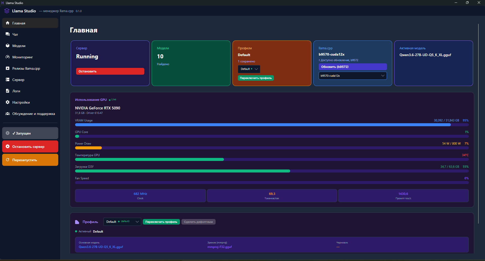

**Чат**
*Встроенный чат с AI, поддержка MCP инструментов.*

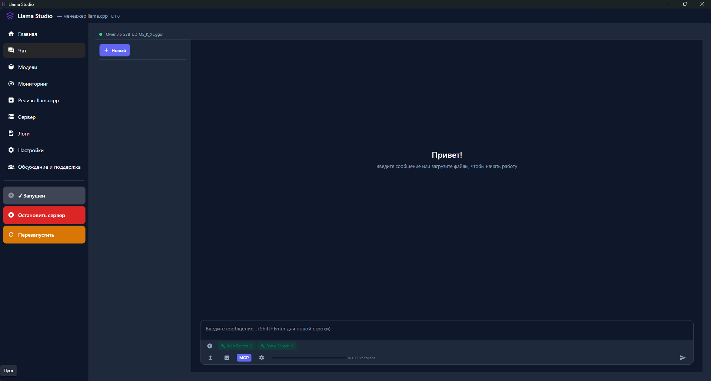

**Модели**
*Список найденных моделей, загрузка с HuggingFace, контекстное меню.*

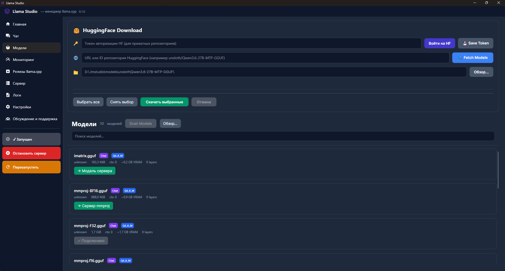

**Мониторинг**
*Скорость токенов (Ответ/Промпт), графики VRAM, температуры, мощности.*

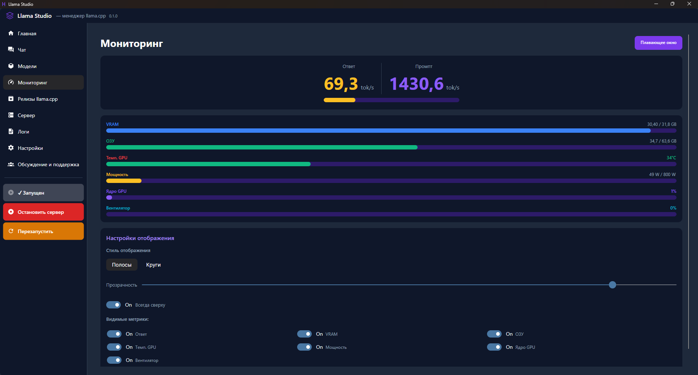

**Релизы llama.cpp**
*Установка и управление версиями сервера (CUDA 12, CUDA 13, CPU).*

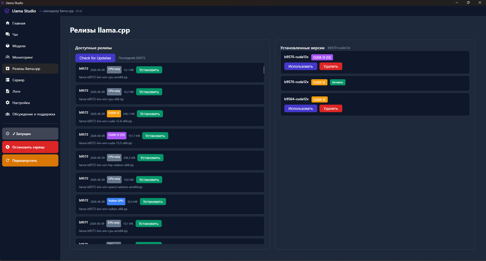

**Сервер (Модель)**
*Выбор основной модели, mmproj (зрение), черновой модели.*

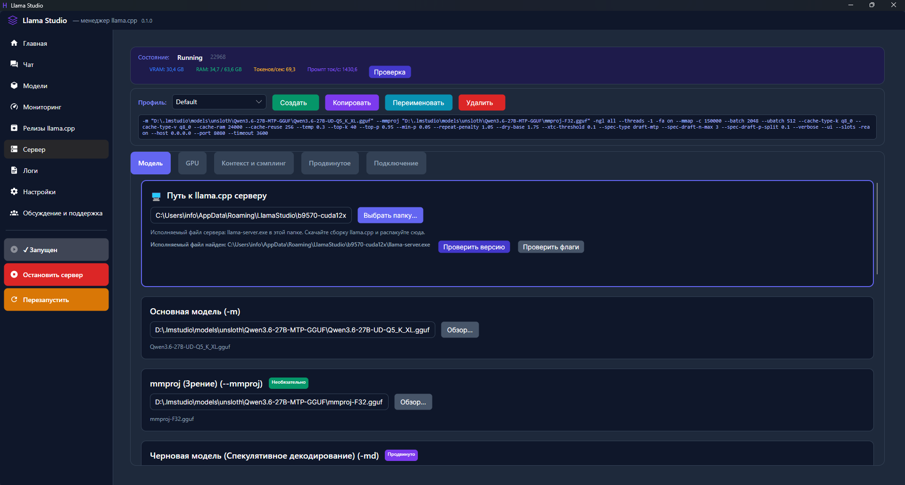

**Сервер (GPU)**
*Слои GPU, потоки, Flash Attention, кэш.*

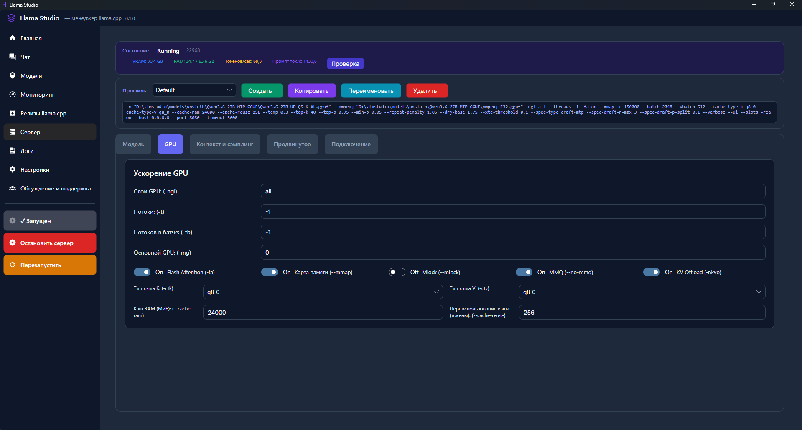

**Сервер (Контекст и сэмплинг)**
*Размер контекста, температура, Top-P/K.*

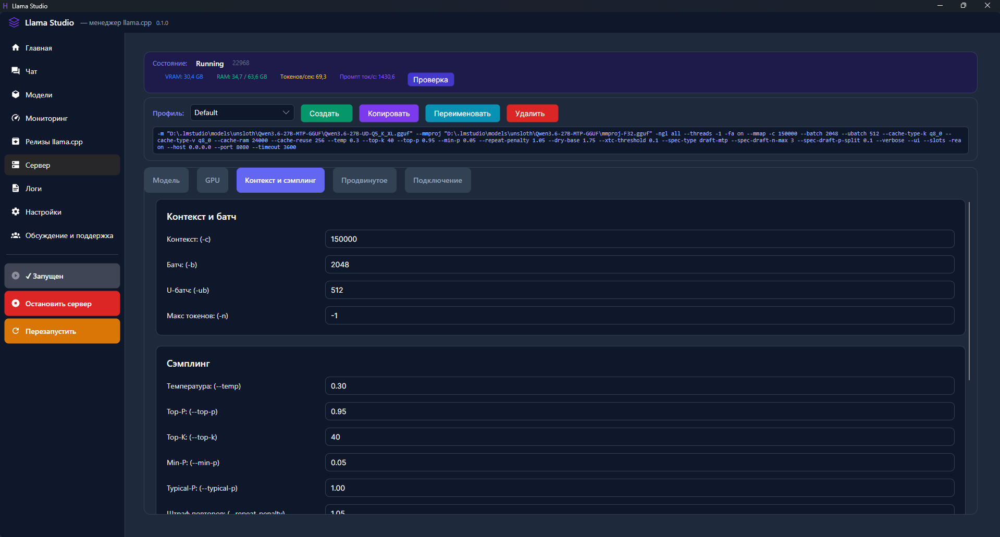

**Сервер (Продвинутое)**
*MTP, спекулятивное декодирование, YARN/Rope.*

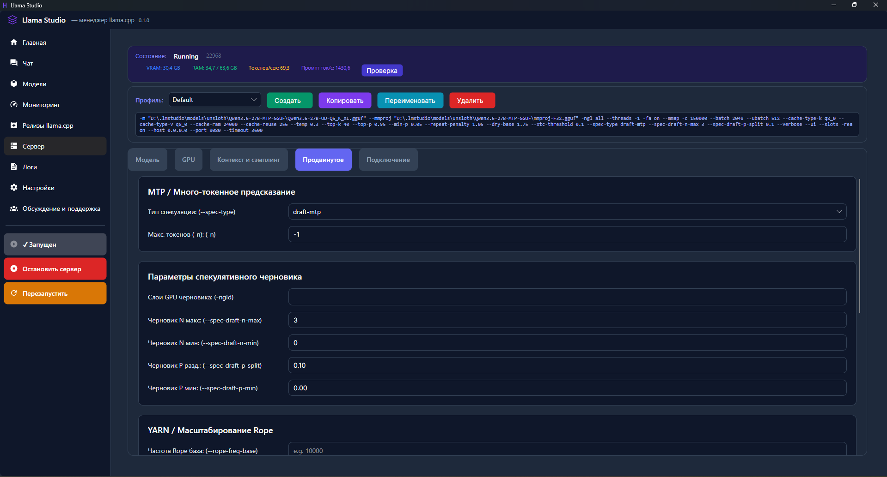

**Логи**
*Вывод логов сервера в реальном времени.*

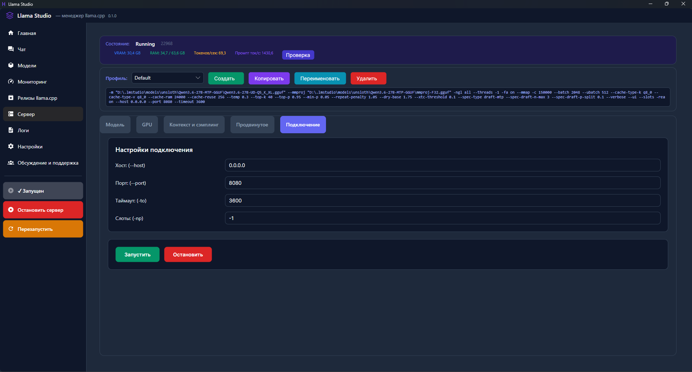

**Настройки**
*Язык, пути, тема, сворачивание в трей, автозапуск.*


**Обсуждение и поддержка**
*Ссылка на Telegram канал, вдохновитель проекта.*

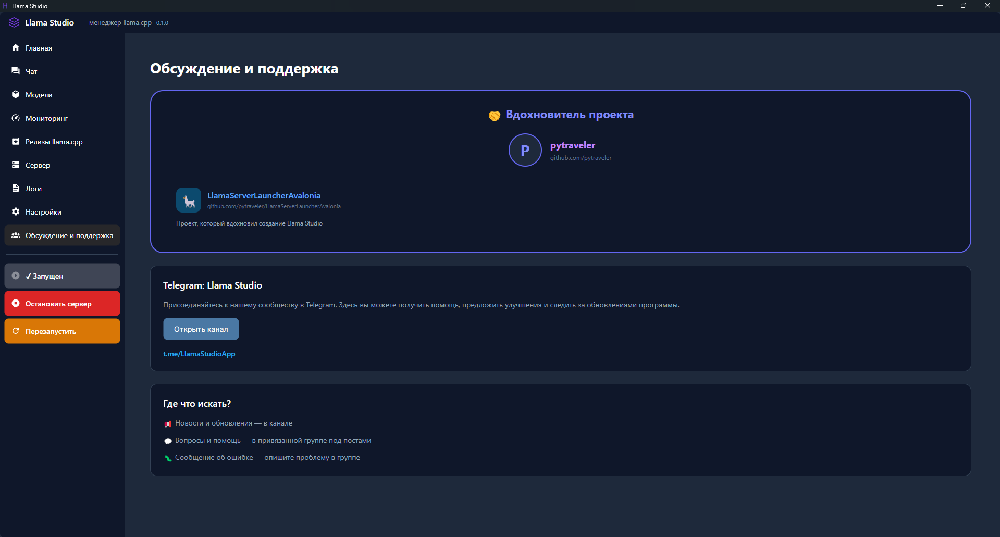

**Плавающее окно мониторинга**
*Компактный мониторинг поверх других окон.*


## 🚀 Установка

1.  Скачайте последнюю версию с вкладки **Releases**.
2.  Распакуйте архив или сразу запустите `LlamaStudio.exe`.
3.  Укажите путь к папке с `llama.cpp` и моделями в настройках.
4.  Готово!

## ⚙️ Системные требования

*   **OS:** Windows 10/11 (x64)
*   **GPU:** NVIDIA (рекомендуется для CUDA) или AMD/Intel (Vulkan)
*   **RAM:** Минимум 16 ГБ (зависит от размера модели)
*   **.NET Runtime:** Не требуется (приложение самодостаточное)

## 🛠 Для разработчиков

Проект написан на **C# (.NET 8)** с использованием **Avalonia UI**.

```bash
# Сборка проекта
dotnet build src/LlamaStudio/LlamaStudio.csproj

# Публикация в один exe файл
dotnet publish src/LlamaStudio/LlamaStudio.csproj -c Release -r win-x64 --self-contained true -o publish/win-x64
```

## 📜 Лицензия

MIT License

## 📞 Поддержка

*   Telegram канал: [Llama Studio App](https://t.me/LlamaStudioApp)
*   Обсуждение и баги: [Discussions](https://github.com/satspace-cpu/llamastudio/discussions)
