# Llama Studio

**Llama Studio** is a self-contained Windows x64 desktop manager for local GGUF models and [llama.cpp](https://github.com/ggml-org/llama.cpp) servers.

The public package is deliberately simple: download one `LlamaStudio.exe` from [Releases](https://github.com/satspace-cpu/llamastudio/releases) and run it. The current screenshots below were captured from the Llama Studio 1.3.0 English build with two GPUs available: NVIDIA GeForce RTX 5090 and Tesla V100.

## What It Does

- Start, stop and restart a local llama.cpp server.
- Create profiles for different models and workloads.
- Select CUDA, Vulkan, CPU and other installed llama.cpp builds.
- Configure one GPU or multiple GPUs without manually typing device strings.
- Set a manual tensor split or use llama.cpp automatic distribution.
- Monitor VRAM, RAM, GPU load, power, temperatures, clocks, fans and Compute Capability.
- Search Hugging Face, inspect repository files and download GGUF models.
- Pause, cancel, resume and recover large downloads.
- Open chat through the local llama-server browser interface.
- Keep logs, use the system tray and receive built-in application updates.

## Main Pages

### 1. Dashboard

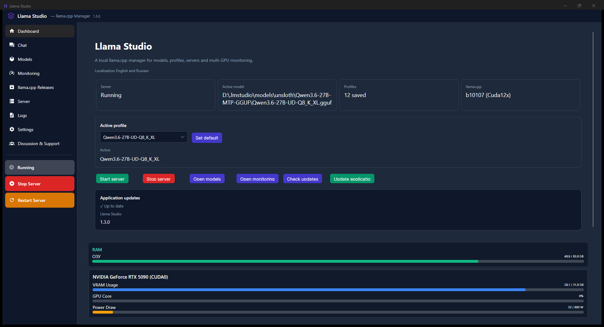

The Dashboard is the starting point. It shows whether the server is running, the active model, the selected profile, the llama.cpp build and the application version. The profile selector and quick actions are available without opening the Server page. The lower part contains the live RAM and GPU cards, so the main page is useful while a model is generating.

### 2. Models and Hugging Face

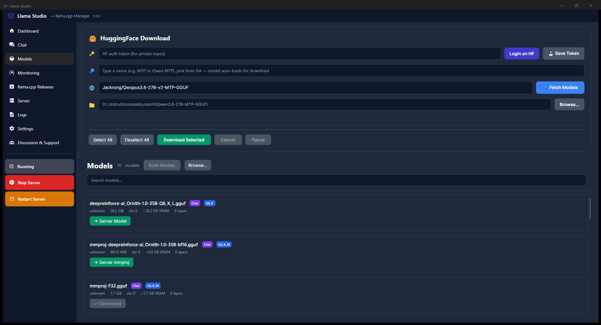

The Models page contains two workflows. The Hugging Face area searches repositories, fills the repository field when a result is selected, and fetches the files available for download. The local model area scans model folders and provides actions such as using a file as the main model or as an `mmproj` vision projector.

For sharded GGUF models, select all required parts. The downloader displays progress, speed, transferred amount and remaining amount. A paused or interrupted download can be continued later.

### 3. Monitoring

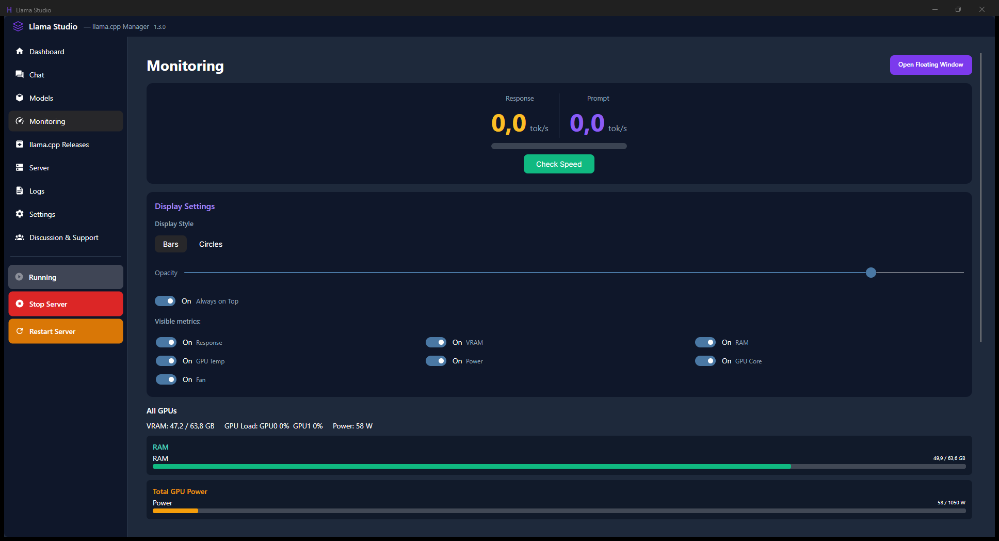

Monitoring separates response speed from prompt-processing speed. The page also provides display controls for always-on-top behavior and visible metrics. The All GPUs section shows total VRAM, system RAM, GPU load and total power. Individual GPU cards continue below the summary.

### 4. llama.cpp Releases

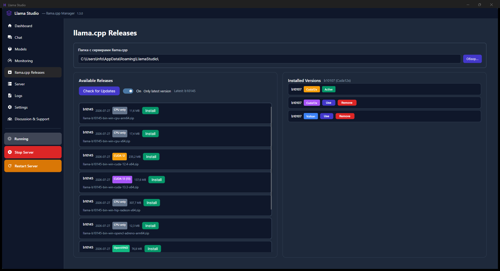

Releases lists installed and available llama.cpp builds. CUDA 12, CUDA 13, Vulkan, CPU, Radeon and other backend packages are kept as separate build types. The active build is marked clearly, and selecting another installed build updates the server selection used by the application.

### 5. Server: model and connection

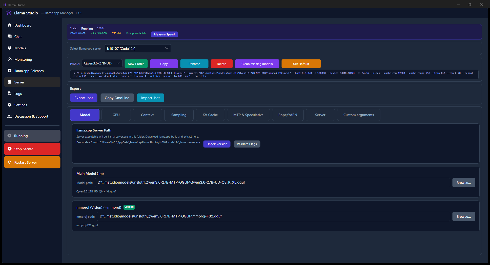

The Server page is the detailed configuration workspace. At the top, choose the installed llama.cpp build and the profile. The command preview shows the exact arguments that will be passed to `llama-server`. The Model tab contains the server executable, the main GGUF model and the optional `mmproj` file.

The remaining tabs are grouped by responsibility: GPU, Context, Sampling, KV Cache, MTP & Speculative, Rope/YARN, Server and Custom arguments.

### 6. Server: GPU and Multi-GPU distribution

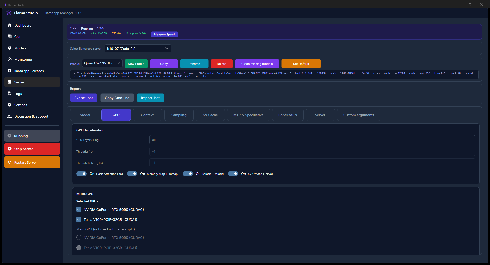

The GPU tab contains GPU acceleration switches and the list of detected devices. In the example both CUDA devices are selected. The main GPU control is available for single-GPU or non-tensor-split modes.

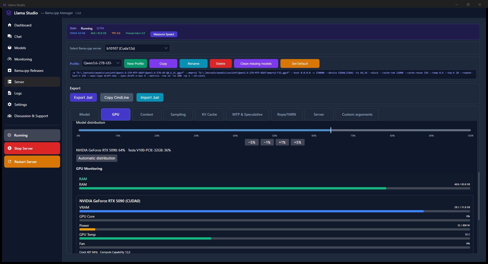

The distribution control is a percentage allocation for the selected GPUs. The `-5%`, `-1%`, `+1%` and `+5%` buttons allow precise adjustments without fighting a small mouse handle. **Automatic distribution** lets llama.cpp fit the model to available device memory. Manual distribution writes the corresponding `--tensor-split` values into the profile.

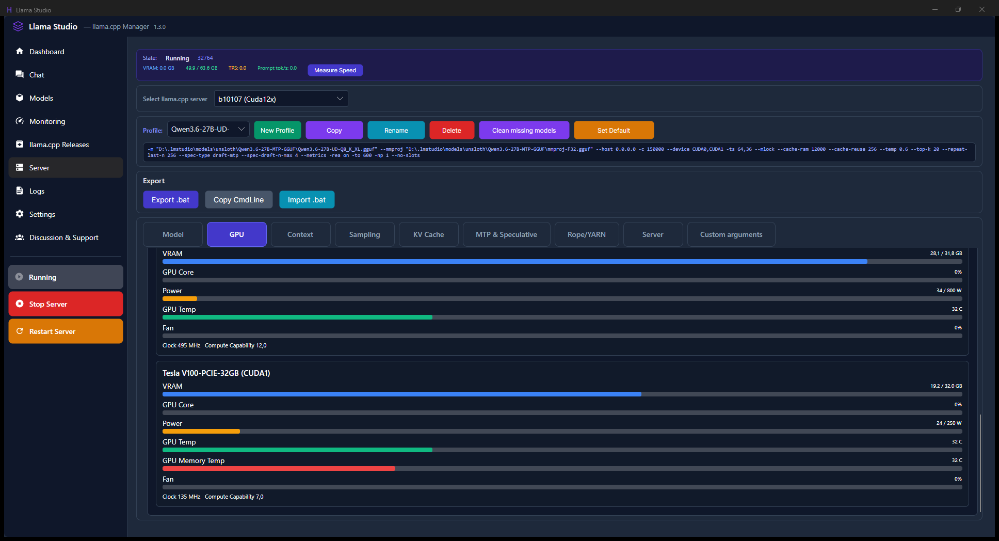

The server page also shows the same live cards as Monitoring. Here both GPUs are visible together, including VRAM, power, temperature, fan and memory temperature when the device reports it.

### 7. Logs

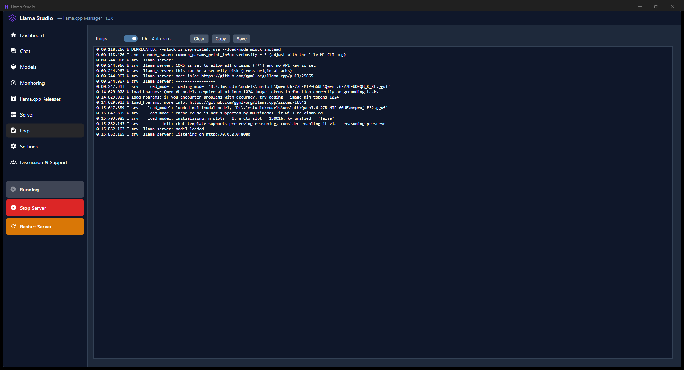

Logs show llama-server startup, model loading, device selection, prompt timing, generation timing and errors. This is the first place to check when a model does not fit or a backend rejects an argument.

### 8. Settings

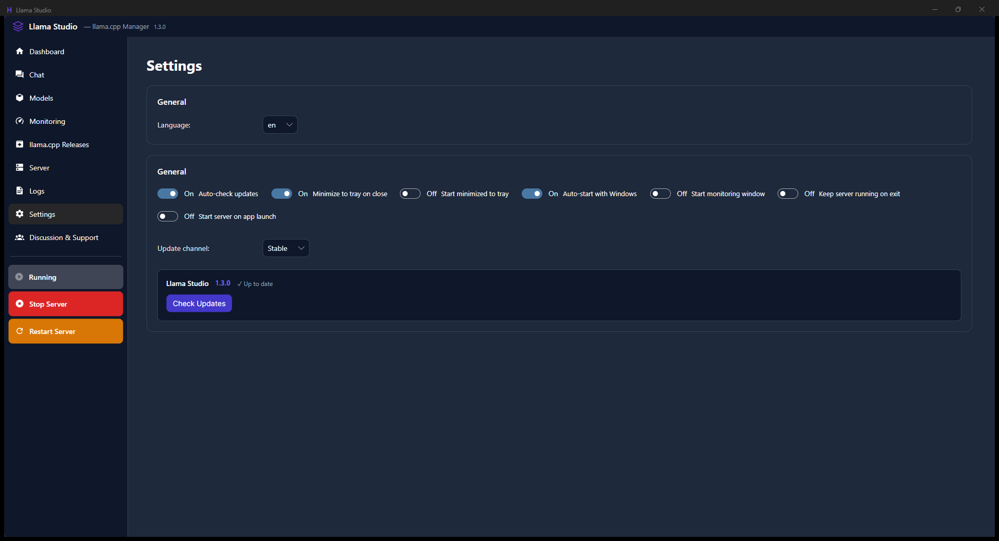

Settings control language, model and llama.cpp directories, update checks, startup behavior, tray behavior and monitoring preferences. Llama Studio 1.3.0 supports English and Russian. The dark theme remains the stable application theme while the incomplete alternative themes are disabled.

### 9. Discussion and Support

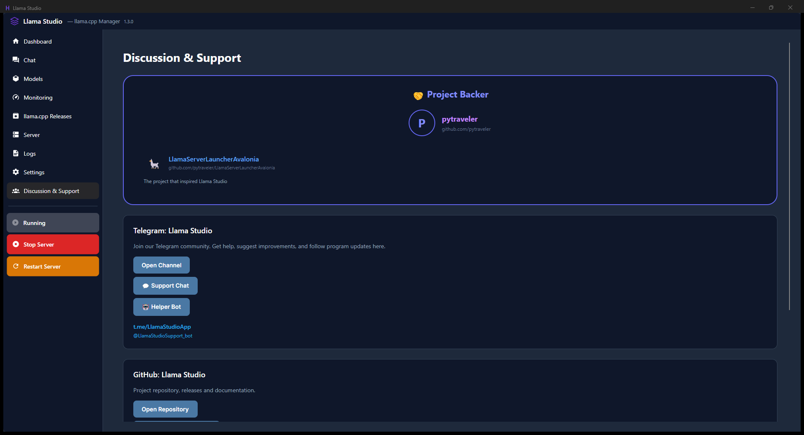

The Support page links to the project repository, discussions and community channels. It is also the place to find the project background and support contacts.

## Multi-GPU Quick Guide

1. Install the required llama.cpp backend from **llama.cpp Releases**.
2. Open **Server > GPU** and wait for device detection.
3. Check the GPUs that should participate in offloading.
4. Use the distribution controls for a manual split, or choose **Automatic distribution**.
5. Keep the command preview visible and confirm that the selected devices and tensor split match the intended setup.
6. Start or restart the server and verify both GPU cards in Monitoring.

`--tensor-split` distributes model tensors between selected GPUs. It is not a direct workload percentage meter. `--main-gpu` is relevant when a single GPU is selected or when tensor split is not being used; it should not override a deliberate multi-GPU tensor split.

## Model Downloads

Hugging Face repositories may contain one GGUF file or a set of numbered shard files such as `00001-of-00003`. A sharded model is one model split into several files. Select every required shard and any matching `mmproj` file. The download manager uses partial files so a pause, application restart or system shutdown does not require starting from zero.

## FAQ

### Why does the server use the wrong GPU?

Check the selected llama.cpp build first. CUDA builds use CUDA device names, while Vulkan and CPU builds have different device capabilities. Then open the profile command preview and confirm that the selected devices belong to the active backend.

### Should I use automatic or manual distribution?

Use automatic distribution as the first attempt, especially with different GPU generations. Use manual distribution when you have tested a stable split and want repeatable behavior. A larger or faster GPU usually receives the larger share, but available VRAM and KV-cache requirements also matter.

### What happens if one GPU is disabled?

The profile keeps the multi-GPU settings for when the device returns. With only one detected GPU, the interface uses the single-GPU path and does not need a tensor split.

### Why can a model still fail when total VRAM is enough?

The model is not the only allocation. Context size, KV cache, batch size, `mmproj`, draft model and runtime buffers also require memory. A log message such as `failed to allocate ... kv cache` means the remaining per-device allocation is insufficient.

### Why is prompt speed different from generation speed?

Prompt processing and token generation are separate operations. Prompt speed is usually much higher for a long batch, while generation speed is limited by autoregressive decoding. The measurement page reports them separately.

### Does the built-in chat replace the llama.cpp web UI?

The application opens the local llama-server browser interface for chat. This keeps chat behavior aligned with the server and avoids duplicating a fragile client implementation inside the manager.

### How do updates work?

The built-in updater reads `latest.json`, compares versions, downloads the new executable and replaces it after confirmation and restart. The public release itself contains only `LlamaStudio.exe`.

### Where are the sources?

The public repository contains the project page, documentation, screenshots and release assets. Development sources and recovery materials are stored separately in the private source repository.

## Installation

1. Open the [latest release](https://github.com/satspace-cpu/llamastudio/releases/latest).
2. Download `LlamaStudio.exe`.
3. Run it on Windows 10/11 x64.
4. Select the llama.cpp and model folders in **Settings**.
5. Select or create a profile and start the server.

The executable is self-contained and does not require a separate .NET Desktop Runtime installation.

## Build Reference

Development builds use .NET 8 and produce a self-contained single-file Windows executable:

```powershell
dotnet publish .\LlamaStudio.csproj -c Release -r win-x64 --self-contained true `
  -p:PublishSingleFile=true `
  -p:IncludeNativeLibrariesForSelfExtract=true `
  -p:DebugType=None -p:DebugSymbols=false
```

The release package must contain one asset only: `LlamaStudio.exe`.

## Localization / Локализация

The application and release notes are available in **English and Russian**.

Приложение и описания релизов доступны на **английском и русском языках**.

## Support

- [GitHub Discussions](https://github.com/satspace-cpu/llamastudio/discussions)
- [Telegram community](https://t.me/LlamaStudioApp)

## License

MIT License.
