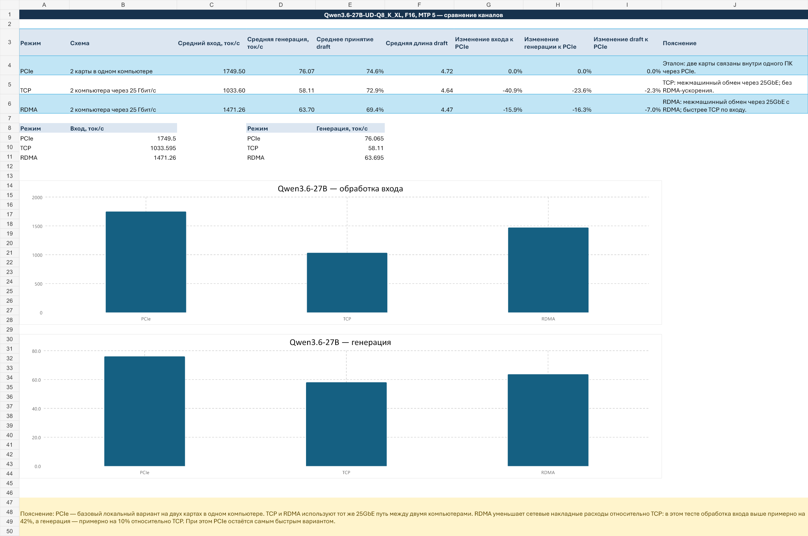
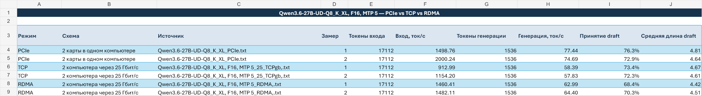

# Уточнение к тесту скорости: PCIe, TCP и RDMA на Qwen3.6-27B

[English version](README.en.md)

Это **уточняющее дополнение** к [тесту RTX 5090 + Tesla V100 через RPC и 25 GbE](../rpc-25gbe/README.md). В исходной статье измерялся обычный RPC-путь через TCP/IP. Здесь для одного и того же профиля Qwen3.6-27B отдельно сопоставлены три режима транспорта: локальный PCIe, межмашинный TCP и межмашинный RDMA.

> Это не замена исходной статьи и не универсальный рейтинг интерфейсов. Дополнение отвечает на более узкий вопрос: насколько RDMA сокращает транспортные накладные расходы относительно TCP в конкретной конфигурации и остаётся ли разрыв с локальным PCIe.

## Что именно сравнивается

| Режим | Топология | Роль в сравнении |
|---|---|---|
| PCIe | Две GPU в одном компьютере | Локальная базовая линия |
| TCP | Два компьютера, прямой канал 25 GbE | Обычный межмашинный транспорт |
| RDMA | Два компьютера, тот же канал 25 GbE | Межмашинный транспорт с меньшими сетевыми накладными расходами |

Во всех шести прогонах использовались модель `Qwen3.6-27B-UD-Q8_K_XL`, F16 и MTP 5, одинаковые 17 112 входных токенов и 1 536 токенов генерации. Для каждого режима выполнено два замера; ниже приведены средние значения.

## Результаты

| Режим | Вход, ток/с | Генерация, ток/с | Принятие draft | Средняя длина draft |
|---|---:|---:|---:|---:|
| PCIe | **1749.50** | **76.07** | **74.6%** | **4.73** |
| TCP | 1033.60 | 58.11 | 72.9% | 4.64 |
| RDMA | 1471.26 | 63.70 | 69.4% | 4.47 |

### RDMA против TCP

- Обработка входа: `1471.26` против `1033.60` ток/с — RDMA быстрее примерно на **42.3%**.
- Генерация: `63.70` против `58.11` ток/с — преимущество RDMA составляет примерно **9.6%**.
- Отставание обработки входа от локального PCIe уменьшается с **40.9%** у TCP до **15.9%** у RDMA.
- Отставание генерации от PCIe уменьшается с **23.6%** до **16.3%**.

Главный эффект RDMA виден на обработке длинного входа: почти две трети потери TCP относительно PCIe удалось вернуть. На генерации выигрыш меньше, потому что авторегрессионный цикл сильнее зависит от последовательных вычислений и задержек, а не только от пропускной способности транспорта.

## Почему PCIe всё ещё быстрее

RDMA снижает накладные расходы сетевого стека, но не превращает два компьютера в одну локальную систему. Между узлами сохраняются задержка, синхронизация RPC и обмен промежуточными данными. Поэтому RDMA заметно приближает результат к PCIe, но в этих измерениях не достигает локальной скорости.

Отдельно важно, что принятие draft у RDMA ниже, чем у TCP и PCIe. Следовательно, весь выигрыш нельзя автоматически приписывать только транспорту: эффективность MTP также менялась между прогонами. Для строгого отделения сетевого эффекта потребовалась бы более длинная серия, фиксация телеметрии сети и отдельный тест без спекулятивного декодирования.

## Разброс двух прогонов

| Режим | Вход: минимум–максимум | Генерация: минимум–максимум |
|---|---:|---:|
| PCIe | 1498.76–2000.24 | 74.69–77.44 |
| TCP | 912.99–1154.20 | 57.83–58.39 |
| RDMA | 1460.41–1482.11 | 62.99–64.40 |

Два прогона достаточны для уточняющего практического наблюдения, но не для статистически устойчивого вывода. Особенно велик разброс обработки входа у PCIe и TCP; поэтому проценты следует читать как результат этого набора измерений, а не как гарантированный коэффициент ускорения.

## Практический вывод

Для этой модели и этого канала 25 GbE RDMA оказался полезным прежде всего при обработке большого входного контекста. Он существенно сократил разрыв с локальным PCIe, но не устранил его. Если задача чувствительна к скорости prefill, RDMA выглядит гораздо предпочтительнее обычного TCP. Если важнее только генерация, выигрыш есть, но он заметно скромнее.

## Данные и ограничения

- [Excel-файл с исходными замерами, формулами и графиками](data/qwen_pcie_tcp_rdma.xlsx)
- Набор содержит по два прогона на режим.
- В исходных данных не зафиксированы версия llama.cpp, параметры RDMA, загрузка сети, задержка, CPU/RAM удалённого узла и полная командная строка.
- Обозначение `RDMA` описывает режим, указанный в журнале измерений; этот набор сам по себе не доказывает использование GPUDirect RDMA или прямого доступа GPU к памяти удалённого узла.

