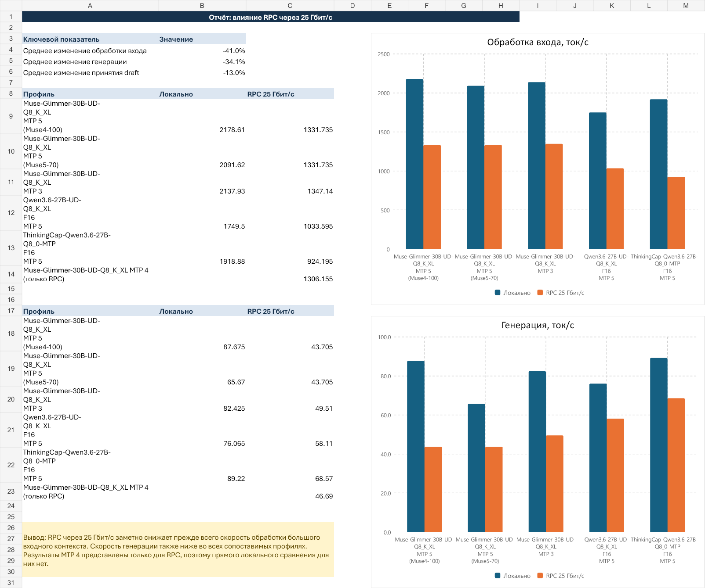
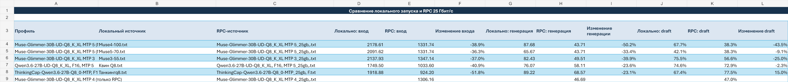
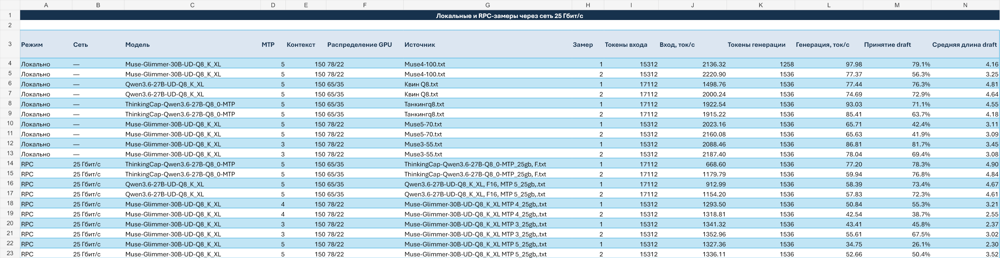

# RTX 5090 + Tesla V100 по RPC через 25 GbE

[English version](README.en.md)

Практический бенчмарк запуска GGUF-моделей в llama.cpp/LlamaStudio: локальная RTX 5090 сравнивается с распределённым запуском, в котором часть модели выполняется на удалённой Tesla V100 через RPC по выделенному Ethernet 25 GbE.

> Измерения и статья подготовлены автором LlamaStudio (`satspace-cpu`). Это практический отчёт о конкретной конфигурации, а не универсальный рейтинг GPU или сетевых адаптеров.

## Конфигурация

| Узел | Оборудование и ПО |
|---|---|
| Локальный | NVIDIA GeForce RTX 5090 32 GB, ASRock X870E Taichi, AMD Ryzen 9 9850X3D, 64 GB RAM, Windows 11 |
| Удалённый RPC | NVIDIA Tesla V100 32 GB, Windows 11 |
| Сеть | Mellanox MCX4121A-ACUT на обоих узлах, прямое соединение 25 GbE |
| Сетевые параметры | Jumbo Packet `9014`, `NlMtuBytes 9000` |
| Стек | llama.cpp / llama-server с ggml-rpc-server, управление через LlamaStudio |

В тестах не использовались PCIe P2P, GPUDirect или RDMA. Поэтому результаты описывают обычный путь Windows 11 + TCP/IP + RPC, а не предельную пропускную способность адаптеров Mellanox.

## Методика

- Для каждого сопоставимого профиля выполнено по два прогона; в таблице приведено среднее.
- Сравниваются скорость обработки входного контекста и скорость генерации в токенах в секунду.
- Использовались одинаковые prompt и параметры теста для локального и RPC-варианта.
- `78/22` и `65/35` — доли tensor split / распределения слоёв между GPU. Это не загрузка GPU и не процент сетевой пропускной способности.

## Результаты

| Профиль | Локально: вход | RPC: вход | Изменение | Локально: генерация | RPC: генерация | Изменение |
|---|---:|---:|---:|---:|---:|---:|
| Muse-Glimmer-30B-UD-Q8_K_XL, MTP 4 (Muse4-100) | 2178.61 | 1331.74 | -38.9% | 87.68 | 43.71 | -50.2% |
| Muse-Glimmer-30B-UD-Q8_K_XL, MTP 5 (Muse5-70) | 2091.62 | 1331.74 | -36.3% | 65.67 | 43.71 | -33.4% |
| Muse-Glimmer-30B-UD-Q8_K_XL, MTP 3 | 2137.93 | 1347.14 | -37.0% | 82.43 | 49.51 | -39.9% |
| Qwen3.6-27B-UD-Q8_K_XL, F16, MTP 5 | 1749.50 | 1033.60 | -40.9% | 76.07 | 58.11 | -23.6% |
| ThinkingCap-Qwen3.6-27B-Q8_0-MTP, F16, MTP 5 | 1918.88 | 924.20 | -51.8% | 89.22 | 68.57 | -23.1% |

По пяти сопоставимым профилям обработка входного контекста снизилась в среднем на **41.0%**, а скорость генерации — на **34.1%**.

## Интерпретация

Наиболее заметное падение относится к обработке большого входного контекста. Для tensor split часть вычислений и промежуточные данные должны пересекать сетевую границу, поэтому даже прямой канал 25 GbE добавляет задержки и накладные расходы RPC.

Генерация в этой конфигурации пострадала меньше, но также остаётся медленнее локального запуска. Лучшее сохранение скорости генерации показали Qwen 3.6 27B и ThinkingCap Qwen: примерно 23% относительно локального результата.

Этот отчёт не утверждает, что 25 GbE ограничен указанными значениями. Он показывает стоимость распределения конкретных моделей и конкретной конфигурации llama.cpp по RPC. Результат будет зависеть от модели, квантования, tensor split, размера контекста, MTP, версии llama.cpp и задержек сети.

## Исходные данные

- [Excel-отчёт с формулами и полными замерами](data/gpu_rpc_25gb_report.xlsx)
- Графики находятся в каталоге [`assets`](assets/).

## Ограничения

Для удалённого узла в исходном наборе не зафиксированы CPU и объём RAM. Поэтому статья фиксирует сетевую конфигурацию и поведение inference, но не приписывает разницу только GPU или только сети.
